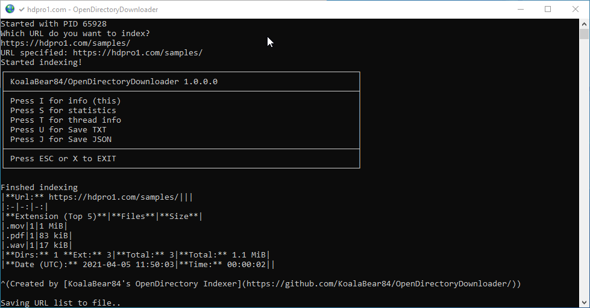

# Open Directory Downloader

Indexes open directories listings in 100+ supported formats, including FTP(S), Google Drive, Bhadoo, GoIndex, Go2Index (alternatives), Dropbox, Mediafire, GoFile, GitHub.



Written in C# with .NET (Core), which means it is **cross platform**!

Downloading is not (yet) implemented, but is already possible when you use the resulting file into another tool (for most of the formats).

Downloading with [wget](https://www.gnu.org/software/wget/):  
`wget -x -i theurlsfile.txt`

Downloading with [aria2c](https://aria2.github.io/) (Does not support directory structure..):  
`aria2c -i theurlsfile.txt`

If you have improvements, supply me with a pull request! If you have a format not yet supported, please let me know.

## Releases / Binaries

For builds (64-bit) for Windows, Linux and Mac, or ARM/ARM64 builds for Pi:

https://github.com/KoalaBear84/OpenDirectoryDownloader/releases

When using the self-contained releases you don't need to install the .NET (Core) Runtime.

## Prerequisites

When you are NOT using the self-contained releases, you need to install the latest/current Runtime version of .NET 6:

https://dotnet.microsoft.com/download/dotnet/6.0/runtime

## Usage

Command line parameters:

| Short | Long                 | Description                                                                                                                                                                                                                   |
| ----- | -------------------- | ----------------------------------------------------------------------------------------------------------------------------------------------------------------------------------------------------------------------------- |
| `-u`  | `--url`              | Url to scan                                                                                                                                                                                                                   |
| `-t`  | `--threads`          | Number of threads (default 5)                                                                                                                                                                                                 |
| `-o`  | `--timeout`          | Number of seconds for timeout                                                                                                                                                                                                 |
| `-w`  | `--wait`             | Number of seconds to wait between calls (when single threaded is too fast..)                                                                                                                                                  |
| `-q`  | `--quit`             | Quit after scanning (No "Press a key")                                                                                                                                                                                        |
| `-c`  | `--clipboard`        | Automatically copy the Reddits stats once the scan is done                                                                                                                                                                    |
| `-j`  | `--json`             | Save JSON file                                                                                                                                                                                                                |
| `-f`  | `--no-urls`          | Do not save URLs file                                                                                                                                                                                                         |
| `-r`  | `--no-reddit`        | Do not show Reddit stats markdown                                                                                                                                                                                             |
| `-l`  | `--upload-urls`      | Uploads urls file                                                                                                                                                                                                             |
| `-e`  | `--exact-file-sizes` | Exact file sizes (WARNING: Uses HEAD requests which takes more time and is heavier for server)                                                                                                                                |
|       | `--fast-scan`        | Only use sizes from HTML, no HEAD requests, even if the approx. size cannot be extracted from the HTML                                                                                                                         |
| `-s`  | `--speedtest`        | Does a speed test after indexing                                                                                                                                                                                              |
| `-a`  | `--user-agent`       | Use custom default User Agent                                                                                                                                                                                                 |
|       | `--username`         | Username                                                                                                                                                                                                                      |
|       | `--password`         | Password                                                                                                                                                                                                                      |
|       | `--github-token`     | GitHub Token                                                                                                                                                                                                                  |
| `-H`  | `--header`           | Supply a custom header to use for each HTTP request. Can be used multiple times for multiple headers. See below for more info.                                                                                                |
|       | `--output-file`      | Output file to use for urls file                                                                                                                                                                                              |
|       | `--proxy-address`    | Proxy address, like "socks5://127.0.0.1:9050" (needed for .onion)                                                                                                                                                             |
|       | `--proxy-username`   | Proxy username                                                                                                                                                                                                                |
|       | `--proxy-password`   | Proxy password                                                                                                                                                                                                                |
|       | `--no-browser`       | Disallow starting Chromium browser (for Cloudflare)                                                                                                                                                                           |

### Example

#### Windows

`OpenDirectoryDownloader.exe --url "https://myopendirectory.com"`

#### Linux

`./OpenDirectoryDownloader --url "https://myopendirectory.com"`

If you want to learn more or contribute, see the following paragraphs!

### Custom Headers

Headers need to be provided in the following format:  
```
<Header Name>: <Header Value>
```
 **This syntax is compatible with e.g. cURL, so that you can copy the headers from a cURL command and re-use them with OpenDirectoryDownloader**.  

This means you can easily "fake" a browser request:  

1. On the page/site you want to index, open your browsers dev tools (`F12` or `CTRL` + `SHIFT` + `i`)
2. Go to the `Network` tab
3. Reload the page
4. Right-click on the first request/item in the network tab and select `Copy > Copy as cURL (bash)` (might be called differently, depending on your browser)
5. The copied command ends with lots of headers (`-H '<something>' -H '<something else>'`). Copy only this part of the command and append it to your OpenDirectoryDownloader command, like so: `OpenDirectoryDownloader --url "https://myopendirectory.com" -H 'header-name-1: header-value-1' -H 'header-name-2: header-value-2' ...`  
   You can of course also use other options with this or omit the `--url` option to use the prompt instead.

Setting some options like `--username` or `--user-agent` might override some headers, as explicit options take precedence. Option order does **not** matter (this applies to OpenDirectoryDownloader in general).  

### Copying on Linux

When you want to copy (`C` key or `-c` flag) the stats at the end on Linux you need to have xclip installed.

### Linux distros

On some distros you need extra dependencies. For Alpine: https://docs.microsoft.com/en-us/dotnet/core/install/linux-alpine

For others see: https://docs.microsoft.com/en-us/dotnet/core/install/linux

## Cloudflare

*EXPERIMANTAL!! READ THIS FIRST!*

IT WILL NOT ALWAYS WORK!

There is experimental support for Cloudflare. When it detects a Cloudflare issue it will download a Chromium browser, start it, in which the Cloudflare protection can be solved. Sometimes this is a captcha which the user (you) needs to solve. For each browser session you have 60 seconds to complete. After that the browser will be killed and you can retry on next request.

Cloudflare does somehow detect that it is not the normal Chromium/Chrome browser and therefore it sadly will not always work. A good tip is move your mouse as soon as possible in the browser.

Sometimes it fails and pops up a browser for every request, and also kills it almost immediately when Cloudflare sees that there is no problem with the session. If this happens, kill the indexer!

If anybody have more info how to get Cloudflare to work better, let me know!

## GitHub

By default GitHub has a rate limit of 60 request per hour, which is enough for 20 repositories with less than 100.000 items. You can increase this limit to 5000 per hour by creating a (personal) token:

1. Go to https://github.com/settings/tokens/new
2. Add a name like "OpenDirectoryDownloader"
3. You don't have to select any scopes!
4. Click "Generate token"
5. Start OpenDirectoryDownloader with --githubtoken <TOKEN>

## Docker

Every release will automatically push an image to the Docker Hub:

https://hub.docker.com/repository/docker/koalabear84/opendirectorydownloader

Run it like:

`docker run --rm -v c:/Scans:/app/Scans -it koalabear84/opendirectorydownloader --quit --speedtest`

It will save the URLs files onto C:\\Scans (windows), or replace with a custom folder on other OS-ses.

\* You can also run it without `-v c:/scans:/app/Scans` if you don't want to save the results on your host.

## Google Colab / Jupyter Notebook

1. Open https://colab.research.google.com/github/KoalaBear84/OpenDirectoryDownloader/blob/master/OpenDirectoryDownloader.ipynb
2. Run step 1 to setup the environment and install the latest OpenDirectoryDownloader
3. Fill in the Url
4. Run step 2
5. Wait until indexing is completed
6. Urls file can be found in Scans folder (see Folder icon on the left sidebar)

## Onion / Tor support

1. Make sure the Tor is running on your machine
2. Use the correct proxy address notation, default for Tor is: "socks5://127.0.0.1:9050"
3. Start it with `--proxy-address` parameter

`OpenDirectoryDownloader.exe --url "http://*.onion/" --proxy-address "socks5://127.0.0.1:9050"`

## Getting the code

### For Visual Studio (Windows)

1.  Install Visual Studio: https://visualstudio.microsoft.com/vs/community/

*   With workload: ".NET Core cross-platform development"
*   With individual components: Code tools > Git for Windows and Code tools > GitHub extension for Visual Studio

1.  Be sure to install Git: https://git-scm.com/downloads
2.  Clone the repository by clicking "Clone or download" and click "Open in Visual Studio"

### For Visual Studio Code

1.  Download Visual Studio Code: https://code.visualstudio.com/download
2.  Be sure to install Git: https://git-scm.com/downloads
3.  Clone the repository: https://code.visualstudio.com/docs/editor/versioncontrol#_cloning-a-repository
4.  More help: https://docs.microsoft.com/en-us/dotnet/core/tutorials/with-visual-studio-code

## Building

1.  Install the newest .NET 6 SDK.
2.  `git clone https://github.com/KoalaBear84/OpenDirectoryDownloader`
3.  `cd OpenDirectoryDownloader/OpenDirectoryDownloader`
4.  `dotnet build .`
5.  `cd bin/Debug/net6.0`
6.  `./OpenDirectoryDownloader --url "https://myopendirectory.com"`

For Linux (Might not be needed since .NET 6):  
Then, if you need to package it into a binary, you can use [warp-packer](https://github.com/dgiagio/warp#quickstart-with-net-core)

When you have cloned the code, you can also run it without the SDK. For that, download the ["Runtime"](https://dotnet.microsoft.com/download) and do "`dotnet run .`" instead of build.

## Google Drive

For Google Drive scanning you need to get a Google Drive API credentials file, it's free!

You can use a many steps manual option, or the 6 steps 'Quickstart' workaround.

Manual/customized:

1.  Go to https://console.cloud.google.com/projectcreate
2.  Fill in Project Name, like "opendirectorydownloader" or so, leave Location unchanged
3.  Change Project ID (optional)
4.  Click "CREATE"
5.  Wait a couple of seconds until the project is created and open it (click "VIEW")
6.  On the APIs pane, click "Go to APIs overview"
7.  Click "ENABLE APIS AND SERVICES"
8.  Enter "Drive", select "Google Drive API"
9.  Click "ENABLE"
10.  Go to "Credentials" menu in the left menu bar
11.  Click "CONFIGURE CONSENT SCREEN"
12.  Choose "External", click "CREATE"
13.  Fill in something like "opendirectorydownloader" in the "Application name" box
14.  At the bottom click "Save"
15.  Go to "Credentials" menu in the left menu bar (again)
16.  Click "CREATE CREDENTIALS"
17.  Select "OAuth client ID"
18.  Select "Desktop app" as "Application type"
19.  Change the name (optional)
20.  Click "Create"
21.  Click "OK" in the "OAuth client created" dialog
22.  In the "OAuth 2.0 Client IDs" section click on the just create Desktop app line
23.  In the top bar, click "DOWNLOAD JSON"
24.  You will get a file like "client\_secret\_xxxxxx.apps.googleusercontent.com.json", rename it to "OpenDirectoryDownloader.GoogleDrive.json" and replace the one in the release

Wow, they really made a mess of this..

Alternative method (easier):

This will 'abuse' a 'Quickstart' project.

1.  Go to https://developers.google.com/drive/api/v3/quickstart/python
2.  Click the "Enabled the Drive API"
3.  "Desktop app" will already be selected on the "Configure your OAuth client" dialog
4.  Click "Create"
5.  Click "DOWNLOAD CLIENT CONFIGURATION"
6.  You will get a file like "credentials.json", rename it to "OpenDirectoryDownloader.GoogleDrive.json" and replace the one in the release

On the first use, you will get a browser screen that you need to grant access for it, and because we haven't granted out OAuth consent screen (This app isn't verified), we get an extra warning. You can use the "Advanced" link, and use the "Go to yourappname (unsafe)" link.

## Support

If you like OpenDirectoryDownloader, please consider supporting me!

[:heart: Sponsor](https://github.com/sponsors/KoalaBear84)

## Contact me

Reddit https://www.reddit.com/user/KoalaBear84
