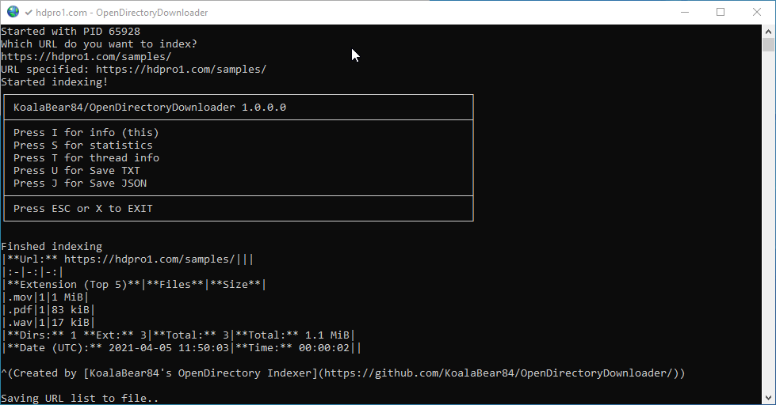

# Open Directory Downloader

Indexes open directories listings in 130+ supported formats, including FTP(S), Google Drive, AList, Directory Lister, HFS, Bhadoo, GoIndex, Go2Index (alternatives), Mediafire, GoFile, GitHub, pCloud, Dufs.



Written in C# with .NET (Core), which means it is **cross platform**!

Downloading is not (yet) implemented, but is already possible when you use the resulting file into another tool (for most of the formats).

Downloading with [wget](https://www.gnu.org/software/wget/):
`wget -x -i theurlsfile.txt`

Downloading with [aria2c](https://aria2.github.io/) with `--aria2-urls` (theurlsfile-aria2.txt):
`aria2c -i theurlsfile-aria2.txt`

Downloading with [aria2c](https://aria2.github.io/) with normal theurlsfile.txt (Does not support directory structure):
`aria2c -i theurlsfile.txt`

For aria2 you sometimes needs `--disable-ipv6` if downloading fails.

If you have improvements, supply me with a pull request! If you have a format not yet supported, please let me know.

## Releases / Binaries

For builds (64-bit) for Windows, Linux and Mac, or ARM/ARM64 builds for Pi:

https://github.com/KoalaBear84/OpenDirectoryDownloader/releases

When using the self-contained releases you don't need to install the .NET (Core) Runtime.

## Prerequisites

When you are NOT using the self-contained releases, you need to install the latest/current Runtime version of .NET 10:

https://dotnet.microsoft.com/download/dotnet/10.0/runtime

## Usage

Command line parameters:

| Short | Long                 | Description                                                                                                                                                                                                                   |
| ----- | -------------------- | ----------------------------------------------------------------------------------------------------------------------------------------------------------------------------------------------------------------------------- |
| `-u`  | `--url`              | Url to scan                                                                                                                                                                                                                   |
| `-t`  | `--threads`          | Number of threads (default 5)                                                                                                                                                                                                 |
| `-o`  | `--timeout`          | Number of seconds for timeout                                                                                                                                                                                                 |
| `-w`  | `--wait`             | Number of seconds to wait between calls (when single threaded is too fast..)                                                                                                                                                  |
| `-q`  | `--quit`             | Quit after scanning (No "Press a key")                                                                                                                                                                                        |
| `-c`  | `--clipboard`        | Automatically copy the Reddits stats once the scan is done                                                                                                                                                                    |
| `-j`  | `--json`             | Save JSON file                                                                                                                                                                                                                |
| `-f`  | `--no-urls`          | Do not save URLs file                                                                                                                                                                                                         |
| `-f`  | `--aria2-urls`       | Save aria2 urls files (with directory support)                                                                                                                                                                                |
| `-r`  | `--no-reddit`        | Do not show Reddit stats markdown                                                                                                                                                                                             |
| `-l`  | `--upload-urls`      | Uploads urls file                                                                                                                                                                                                             |
| `-e`  | `--exact-file-sizes` | Exact file sizes (WARNING: Uses HEAD requests which takes more time and is heavier for server)                                                                                                                                |
|       | `--fast-scan`        | Only use sizes from HTML, no HEAD requests, even if the approx. size cannot be extracted from the HTML                                                                                                                        |
| `-s`  | `--speedtest`        | Does a speed test after indexing                                                                                                                                                                                              |
| `-a`  | `--user-agent`       | Use custom default User Agent                                                                                                                                                                                                 |
|       | `--username`         | Username                                                                                                                                                                                                                      |
|       | `--password`         | Password                                                                                                                                                                                                                      |
|       | `--github-token`     | GitHub Token                                                                                                                                                                                                                  |
| `-H`  | `--header`           | Supply a custom header to use for each HTTP request. Can be used multiple times for multiple headers. See below for more info.                                                                                                |
|       | `--output-file`      | Output file to use for urls file                                                                                                                                                                                              |
|       | `--proxy-address`    | Proxy address, like "socks5://127.0.0.1:9050" (needed for .onion)                                                                                                                                                             |
|       | `--proxy-username`   | Proxy username                                                                                                                                                                                                                |
|       | `--proxy-password`   | Proxy password                                                                                                                                                                                                                |
|       | `--flaresolverr-url` | FlareSolverr endpoint URL, e.g. `http://127.0.0.1:8191`. If provided, this endpoint is used as HTTP handler to solve Cloudflare challenges.                                                                                |
|       | `--flaresolverr-docker-name` | FlareSolverr Docker container name, e.g. `flaresolverr`. If provided, OpenDirectoryDownloader will also show and save the output from `docker logs -f` for that container.                                      |
|       | `--no-browser`       | Disallow starting Chromium browser (for Cloudflare)                                                                                                                                                                           |
|       | `--http-cloak`       | *SLOWER!* *EXPERIMENTAL* Emulate a real browser's TLS/HTTP fingerprint for improved compatibility. See below for more info.                                                                                                            |
|       | `--use-database`     | EXPERIMENTAL: Mirror the scan to a SQLite database as it runs, for `--resume` (see [Large scans / low memory](#large-scans--low-memory))                                                                                     |
|       | `--db-path`          | Path for the SQLite database used by `--use-database`/`--resume` (default: output base filename with a `.sqlite` extension)                                                                                                  |
|       | `--keep-db`          | Keep the database file after a successful scan instead of deleting it                                                                                                                                                        |
|       | `--evict-memory`     | EXPERIMENTAL: Requires `--use-database`. Actually reduces peak memory on very large scans by dropping finished directories from memory (see [Large scans / low memory](#large-scans--low-memory))                           |
|       | `--resume`            | EXPERIMENTAL: Continue a previously interrupted scan from its database instead of starting over (see [Large scans / low memory](#large-scans--low-memory))                                                                   |
|       | `--retry-errors`     | With `--resume`, retry directories that errored during the previous run instead of leaving them as-is                                                                                                                       |
|       | `--serve`            | EXPERIMENTAL: Start a local web viewer for a scan database instead of scanning a URL (see [Web viewer for scan databases](#web-viewer-for-scan-databases))                                                                   |
|       | `--serve-db`          | Path to a `.sqlite` scan database to preload when using `--serve`. Optional - a database can also be dropped onto the page                                                                                                   |
|       | `--serve-port`        | Port for `--serve` (default: `8080`). If it's already in use, the next port is tried automatically (up to 20 attempts)                                                                                                        |
|       | `--serve-host`        | Host/IP to bind `--serve` to (default: `127.0.0.1`, loopback only - the server has no authentication)                                                                                                                        |
|       | `--serve-no-browser`  | Don't automatically open the default browser when `--serve` starts                                                                                                                                                            |

### Example

#### Windows

`OpenDirectoryDownloader.exe --url "https://myopendirectory.com"`

#### Linux

`./OpenDirectoryDownloader --url "https://myopendirectory.com"`

If you want to learn more or contribute, see the following paragraphs!

### Custom Headers

Headers need to be provided in the following format:  
```
<Header Name>: <Header Value>
```
 **This syntax is compatible with e.g. cURL, so that you can copy the headers from a cURL command and re-use them with OpenDirectoryDownloader**.  

This means you can easily "fake" a browser request:  

1. On the page/site you want to index, open your browsers dev tools (`F12` or `CTRL` + `SHIFT` + `i`)
2. Go to the `Network` tab
3. Reload the page
4. Right-click on the first request/item in the network tab and select `Copy > Copy as cURL (bash)` (might be called differently, depending on your browser)
5. The copied command ends with lots of headers (`-H '<something>' -H '<something else>'`). Copy only this part of the command and append it to your OpenDirectoryDownloader command, like so: `OpenDirectoryDownloader --url "https://myopendirectory.com" -H 'header-name-1: header-value-1' -H 'header-name-2: header-value-2' ...`  
   You can of course also use other options with this or omit the `--url` option to use the prompt instead.

Setting some options like `--username` or `--user-agent` might override some headers, as explicit options take precedence. Option order does **not** matter (this applies to OpenDirectoryDownloader in general).  

### Copying on Linux

When you want to copy (`C` key or `-c` flag) the stats at the end on Linux you need to have xclip installed.

### Linux distros

On some distros you need extra dependencies. For Alpine: https://docs.microsoft.com/en-us/dotnet/core/install/linux-alpine

For others see: https://docs.microsoft.com/en-us/dotnet/core/install/linux

## Large scans / low memory

*EXPERIMENTAL!*

Scanning a very large open directory (millions of files) can use a lot of memory, since the whole listing is normally kept in memory until the scan finishes. `--use-database` and `--evict-memory` reduce that, and `--resume` lets you pick a scan back up instead of starting over:

| Flag              | What it does                                                                                                          |
| ----------------- | ---------------------------------------------------------------------------------------------------------------------- |
| `--use-database`  | Mirrors the scan to a SQLite database as it runs. On its own this doesn't reduce memory usage yet, but is required for the other flags below. |
| `--evict-memory`  | Requires `--use-database`. Once a directory (and everything under it) has finished scanning, its data is dropped from memory and read back from the database when needed - this is what actually caps peak memory. |
| `--resume`        | Continues a previously interrupted scan using the database at `--db-path` (or the default, derived from the output filename), instead of starting over. Implies `--use-database`, and always keeps the database file so an interrupted resume can itself be resumed again. If no matching database is found, starts a fresh scan as normal. |
| `--retry-errors`  | With `--resume`: retries directories that errored during the previous run. Without it, if any errored directories are found and the console is interactive you'll be asked whether to retry them; in a non-interactive session (e.g. a script) they're left alone unless you pass this. |

Example:

```
OpenDirectoryDownloader --url "https://myopendirectory.com" --use-database --evict-memory --resume
```

If you need to stop a scan early, press **`P`** to pause: it finishes any in-flight requests, safely saves the database, and exits - unlike a hard kill (`Ctrl+C`, closing the window), this guarantees the database is in a consistent, resumable state. Run the same command again with `--resume` added to continue where you left off.

The database also keeps a small history of the scan itself: the root URL, when it was first started, when it completed (if it has), and one entry per run/resume attempt with that run's cumulative HTTP traffic, requests, errors and skipped count. Resuming prints a summary of this, e.g.:

```
Successfully resumed from database: myopendirectory.sqlite
  Site: https://myopendirectory.com/
  This is attempt #2 (1 prior attempt); first started 2026-09-15 09:56 UTC.
  Already in database: 4 of 7 directories finished, 8 of 8 files with a known size.
  Queued: 3 directories to (re)process, 0 file sizes to look up.
```

These flags don't change the JSON/URLs/aria2 output format - resuming a scan produces the exact same output as if it had never been interrupted.

A `--use-database` database can also be browsed interactively afterwards - see [Web viewer for scan databases](#web-viewer-for-scan-databases) below.

## Web viewer for scan databases

*EXPERIMENTAL!*

Any `.sqlite` database produced by `--use-database` (finished or not - see [Large scans / low memory](#large-scans--low-memory) above) can be browsed in your browser instead of only reading the JSON/TXT/aria2 output files: a tree view with size-proportional progress bars, an optional image gallery, and per-file or per-directory (as a ZIP) downloads straight from the original site.

Start the server:

```
OpenDirectoryDownloader --serve
```

Then open a database one of two ways:

- **Drag a `.sqlite` file straight onto the `OpenDirectoryDownloader` executable** in Explorer - it launches the server preloaded with that database and opens your browser automatically.
- **Drag a `.sqlite` file onto the page** while the server is running (works at any time, including to switch to a different database).

By default the server only listens on `127.0.0.1` (loopback) since it has no authentication - use `--serve-host`/`--serve-port` to change that only on a trusted network. `--serve-db <path>` preloads a database from the command line instead of dragging one, and `--serve-no-browser` skips automatically opening a browser tab.

The folder listing renders only the rows currently in view (via [Clusterize.js](https://clusterize.js.org/), loaded from a CDN) so even directories with hundreds of thousands of entries stay smooth to scroll. This is the one part of the viewer that needs internet access - everything else is served entirely from the `.exe` itself.

While a database is open, SQLite's own `-wal`/`-shm` sidecar files appear next to it - normal for browsing a WAL-mode database, not something the viewer writes itself, and needed to support opening a database another process is still actively scanning. Stopping the server (Ctrl+C) cleans those up automatically; killing the process instead (e.g. Task Manager, `kill -9`) skips that cleanup, same as force-killing any other program, though the leftover files are harmless and SQLite recovers them correctly the next time anything opens that database.

In the viewer:

- Each row's progress bar shows its size relative to the largest entry in that folder, with the folder's total size shown above the list.
- Click the **Name**/**Size** column headers to sort the current folder (folders always stay listed before files); click again to reverse the direction.
- The search box instantly filters the current folder as you type, and (once you've typed 2+ characters) also searches the whole database for matches elsewhere, listed under "Elsewhere in this scan" with a **Show in folder** link and **Download** button - handy for finding a file without clicking through the tree. Note this search is a substring scan of every file/directory name, so it can be slow on a database with millions of rows.
- The **Gallery view** checkbox (off by default) switches image files in the current folder to a thumbnail grid.
- Every file has a **Download** button; every folder has a **ZIP** button that downloads the whole folder as a ZIP (built on the fly, with a live progress panel showing files done and bytes written) while preserving its directory structure.
- Every row also has a 🔗 button that opens the file/folder's real URL on the original site directly, bypassing the viewer entirely - handy for e.g. opening a Google Drive file in Drive's own viewer instead of downloading it.
- The bar under the root URL also shows which Open Directory "engine(s)" were detected while scanning (e.g. `AList`, `Dufs`, or one of the generic listing formats) - `Type: X`, or `Types: X, Y` if more than one was seen across the scan.
- Files get an icon based on their media type (image/video/audio/document/archive/etc.); a Google Drive-native file (Doc, Sheet, Slide, ...) that has no real file extension gets a matching icon and a small type badge instead.
- Click **&uarr; Up** (next to the breadcrumbs) to jump to the parent folder.
- The bar under the root URL also shows the scan's total file count, total size, and the `.sqlite` database's own file size, available as soon as the page loads.
- The **Statistics** button opens a panel with a media-type breakdown (a pie chart by size, with each slice's file count), the top 10 most common file extensions by file count and size, and the scan's `--speedtest` result (if one was run) - downloaded amount, duration, and peak speed.

## TLS errors (Windows 10)

If you received errors like this, please apply the registry file "Enable TLS 1.3.reg" from this [site](https://www.itechtics.com/tls-1-3/).

```
System.Net.Http.HttpRequestException: The SSL connection could not be established, see inner exception.
 ---> System.Security.Authentication.AuthenticationException: Authentication failed because the remote party sent a TLS alert: 'ProtocolVersion'.
 ---> System.ComponentModel.Win32Exception (0x80090326): The message received was unexpected or badly formatted.
 ```

Alternatively, you can try the experimental [`--http-cloak`](#http-cloak-experimental) option, which does its own TLS handling independent of the OS/.NET TLS stack and so may avoid this error without needing the registry fix.

## HTTP Cloak (Experimental)

`--http-cloak` emulates a real browser's TLS/HTTP fingerprint, for improved compatibility. Use it on its own to default to the `chrome-latest` preset, or specify one explicitly, e.g. `--http-cloak firefox-latest` (other presets: `safari-latest`, `chrome-latest-windows`, etc).

This might also help as an alternative to the registry fix mentioned above under [TLS errors (Windows 10)](#tls-errors-windows-10), since it does its own TLS handling independent of the OS/.NET TLS stack.

Note: when enabled, it bypasses this app's SSL certificate validation and automatic decompression, and has no native binary for linux-arm.

**It is a lot slower than scanning without it** (measured 6-70x, depending on site and `--threads`), only use `--http-cloak` when you actually need it!

## Cloudflare

*EXPERIMANTAL!! READ THIS FIRST!*

IT WILL NOT ALWAYS WORK!

There is experimental support for Cloudflare. When it detects a Cloudflare issue it will download a Chromium browser, start it, in which the Cloudflare protection can be solved. Sometimes this is a captcha which the user (you) needs to solve. For each browser session you have 60 seconds to complete. After that the browser will be killed and you can retry on next request.

Cloudflare does somehow detect that it is not the normal Chromium/Chrome browser and therefore it sadly will not always work. A good tip is move your mouse as soon as possible in the browser.

Sometimes it fails and pops up a browser for every request, and also kills it almost immediately when Cloudflare sees that there is no problem with the session. If this happens, kill the indexer!

If you are using FlareSolverr in Docker, you can now also stream its container logs in the app by supplying both `--flaresolverr-url` and `--flaresolverr-docker-name`, for example:

`OpenDirectoryDownloader.exe --url "https://myopendirectory.com" --flaresolverr-url "http://127.0.0.1:8191" --flaresolverr-docker-name "flaresolverr"`

This reads the container output using `docker logs -f <container-name>`, shows it in the console, and writes it to the normal log file.

If anybody have more info how to get Cloudflare to work better, let me know!

## GitHub

By default GitHub has a rate limit of 60 request per hour, which is enough for 20 repositories with less than 100.000 items. You can increase this limit to 5000 per hour by creating a (personal) token:

1. Go to https://github.com/settings/tokens/new
2. Add a name like "OpenDirectoryDownloader"
3. You don't have to select any scopes!
4. Click "Generate token"
5. Start OpenDirectoryDownloader with --githubtoken <TOKEN>

## Docker

Every release will automatically push an image to Docker Hub and GitHub Container Registry:

**Docker Hub:**
https://hub.docker.com/repository/docker/koalabear84/opendirectorydownloader

**GitHub Container Registry (ghcr.io):**
https://github.com/KoalaBear84/OpenDirectoryDownloader/pkgs/container/opendirectorydownloader

Run it like:

`docker run --rm -v c:/Scans:/app/Scans -it koalabear84/opendirectorydownloader --quit --speedtest`

Or with GitHub Container Registry:

`docker run --rm -v c:/Scans:/app/Scans -it ghcr.io/koalabear84/opendirectorydownloader --quit --speedtest`

It will save the URLs files onto C:\\Scans (windows), or replace with a custom folder on other OS-ses.

\* You can also run it without `-v c:/scans:/app/Scans` if you don't want to save the results on your host.

## Google Colab / Jupyter Notebook

1. Open https://colab.research.google.com/github/KoalaBear84/OpenDirectoryDownloader/blob/master/OpenDirectoryDownloader.ipynb
2. Run step 1 to setup the environment and install the latest OpenDirectoryDownloader
3. Fill in the Url
4. Run step 2
5. Wait until indexing is completed
6. Urls file can be found in Scans folder (see Folder icon on the left sidebar)

## Onion / Tor support

1. Make sure the Tor is running on your machine
2. Use the correct proxy address notation, default for Tor is: "socks5://127.0.0.1:9050"
3. Start it with `--proxy-address` parameter

`OpenDirectoryDownloader.exe --url "http://*.onion/" --proxy-address "socks5://127.0.0.1:9050"`

## Getting the code

### For Visual Studio (Windows)

1.  Install Visual Studio: https://visualstudio.microsoft.com/vs/community/

*   With workload: ".NET Core cross-platform development"
*   With individual components: Code tools > Git for Windows and Code tools > GitHub extension for Visual Studio

1.  Be sure to install Git: https://git-scm.com/downloads
2.  Clone the repository by clicking "Clone or download" and click "Open in Visual Studio"

### For Visual Studio Code

1.  Download Visual Studio Code: https://code.visualstudio.com/download
2.  Be sure to install Git: https://git-scm.com/downloads
3.  Clone the repository: https://code.visualstudio.com/docs/editor/versioncontrol#_cloning-a-repository
4.  More help: https://docs.microsoft.com/en-us/dotnet/core/tutorials/with-visual-studio-code

## Building

1.  Install the newest .NET 10 SDK: https://dotnet.microsoft.com/download/dotnet/10.0
2.  `git clone https://github.com/KoalaBear84/OpenDirectoryDownloader`
3.  `cd OpenDirectoryDownloader/src`
4.  `dotnet build .`
5.  `cd OpenDirectoryDownloader/bin/Debug/net10.0`
6.  `./OpenDirectoryDownloader --url "https://myopendirectory.com"`

For Linux (Might not be needed since .NET 7):  
Then, if you need to package it into a binary, you can use [warp-packer](https://github.com/dgiagio/warp#quickstart-with-net-core)

When you have cloned the code, you can also run it without the SDK. For that, download the ["Runtime"](https://dotnet.microsoft.com/download) and do "`dotnet run .`" instead of build.

## Google Drive

For Google Drive scanning you need to get a Google Drive API credentials file, it's free!

You can use a many steps manual option, or the 6 steps 'Quickstart' workaround.

Manual/customized:

1.  Go to https://console.cloud.google.com/projectcreate
2.  Fill in Project Name, like "opendirectorydownloader" or so, leave Location unchanged
3.  Change Project ID (optional)
4.  Click "CREATE"
5.  Wait a couple of seconds until the project is created and open it (click "VIEW")
6.  On the APIs pane, click "Go to APIs overview"
7.  Click "ENABLE APIS AND SERVICES"
8.  Enter "Drive", select "Google Drive API"
9.  Click "ENABLE"
10.  Go to "Credentials" menu in the left menu bar
11.  Click "CONFIGURE CONSENT SCREEN"
12.  Choose "External", click "CREATE"
13.  Fill in something like "opendirectorydownloader" in the "Application name" box
14.  At the bottom click "Save"
15.  Go to "Credentials" menu in the left menu bar (again)
16.  Click "CREATE CREDENTIALS"
17.  Select "OAuth client ID"
18.  Select "Desktop app" as "Application type"
19.  Change the name (optional)
20.  Click "Create"
21.  Click "OK" in the "OAuth client created" dialog
22.  In the "OAuth 2.0 Client IDs" section click on the just create Desktop app line
23.  In the top bar, click "DOWNLOAD JSON"
24.  You will get a file like "client\_secret\_xxxxxx.apps.googleusercontent.com.json", rename it to "OpenDirectoryDownloader.GoogleDrive.json" and replace the one in the release

Wow, they really made a mess of this..

Alternative method (easier):

This will 'abuse' a 'Quickstart' project.

1.  Go to https://developers.google.com/drive/api/v3/quickstart/python
2.  Click the "Enabled the Drive API"
3.  "Desktop app" will already be selected on the "Configure your OAuth client" dialog
4.  Click "Create"
5.  Click "DOWNLOAD CLIENT CONFIGURATION"
6.  You will get a file like "credentials.json", rename it to "OpenDirectoryDownloader.GoogleDrive.json" and replace the one in the release

On the first use, you will get a browser screen that you need to grant access for it, and because we haven't granted out OAuth consent screen (This app isn't verified), we get an extra warning. You can use the "Advanced" link, and use the "Go to yourappname (unsafe)" link.

### Headless / server usage

If you run OpenDirectoryDownloader on a server with no browser available, it can't open a browser automatically for the first-time authorization. Instead of crashing, it will print the authorization URL and wait for you to complete it manually:

```
Could not open a browser automatically (this looks like a headless environment).
Open this URL manually in any browser to authorize Google Drive access:

    https://accounts.google.com/o/oauth2/v2/auth?...

If this is a remote/headless server, forward the port first, e.g.:
    ssh -L 51823:localhost:51823 <user>@<server>
then open the URL above on your local machine.

Waiting for authorization...
```

Forward the port shown in the printed URL's `redirect_uri` over SSH (`ssh -L <port>:localhost:<port> <user>@<server>`), then open the URL in a browser on your own machine. Once you grant access, the callback is tunneled back to the server and `token.json` is created there, same as a normal authorization.

## Support

If you like OpenDirectoryDownloader, please consider supporting me!

[:heart: Sponsor](https://github.com/sponsors/KoalaBear84)

## Contact me

Reddit https://www.reddit.com/user/KoalaBear84
